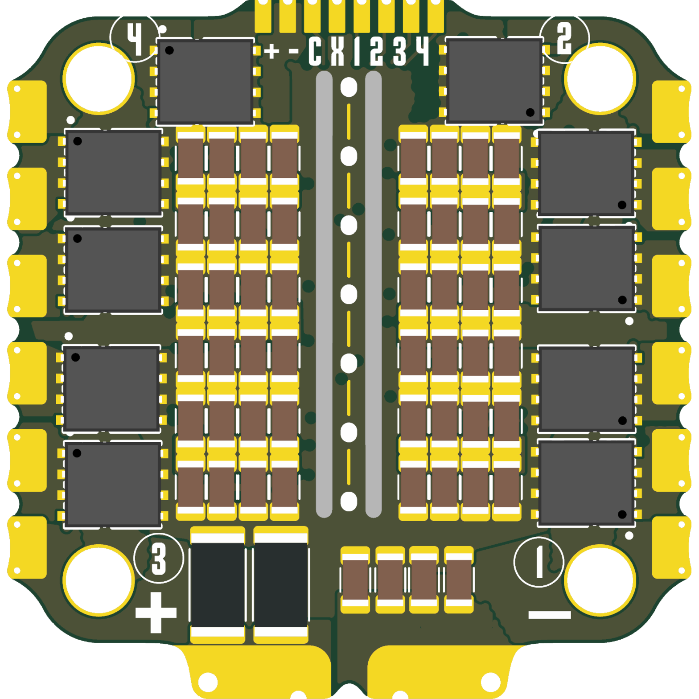
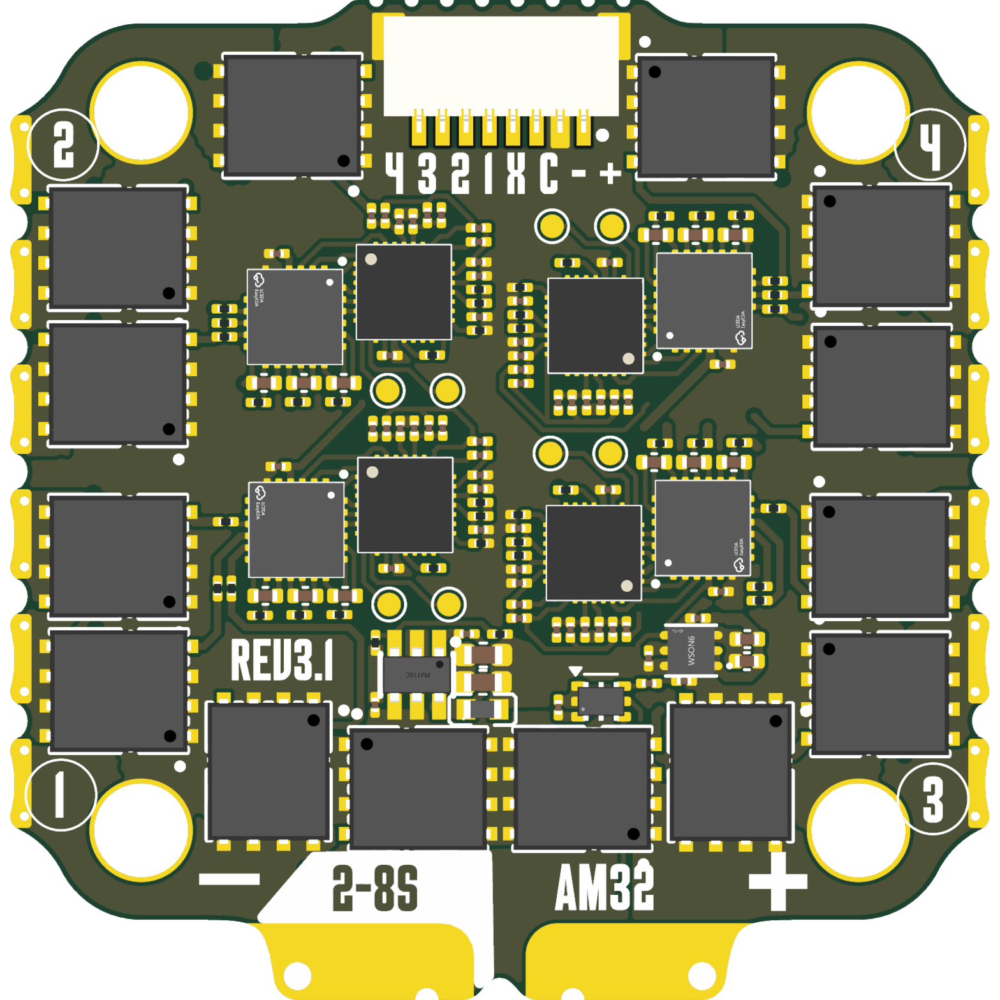

# OpenESC-30x30

Open source 4-in-1 BLDC ESC with a 30.5 x 30.5 mm mounting pattern, part of the
incutec OpenDrone line. Four independent motor controllers, each with its own
MCU, gate driver and six MOSFETs, running AM32 and taking DShot over the
standard 8-pin connector.

## Specifications

| | |
|---|---|
| Firmware | AM32 |
| ESC protocol | DShot, bidirectional |
| Telemetry | Extended DShot |
| Input | 3-8S LiPo |
| BEC | None |
| MCU | One per motor |
| MOSFETs | 6 per motor |
| Current sense | On-board, 330 A |
| TVS protection | None |
| FC connector | JST-SH 8-pin |
| Mounting | 30.5 x 30.5 mm, 4.0 mm holes |
| PCB | 6-layer, 2 oz copper |

Technical write-up, part list and layout constraints: [AGENTS.md](AGENTS.md).

## In the line

What pairs with what, and what is available:
[opendrone.be](https://opendrone.be).

## Contributing

See [CONTRIBUTING.md](CONTRIBUTING.md).

## License

Hardware licensed under [CERN-OHL-S-2.0](https://ohwr.org/cern_ohl_s_v2.txt),
see [LICENSE](LICENSE).
